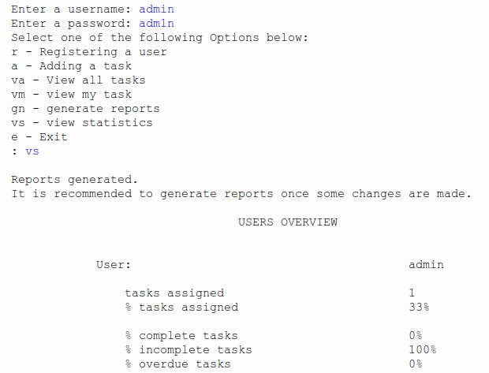
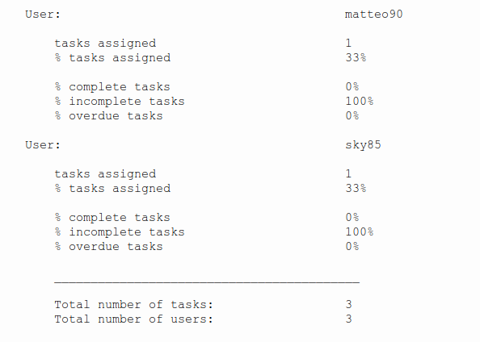
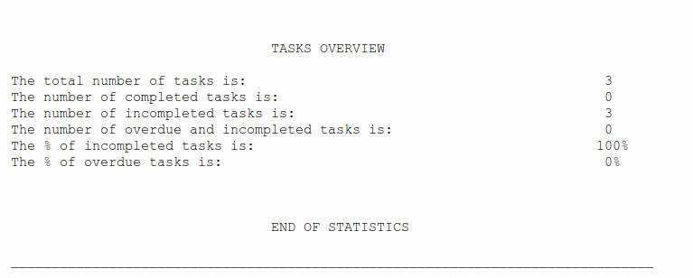
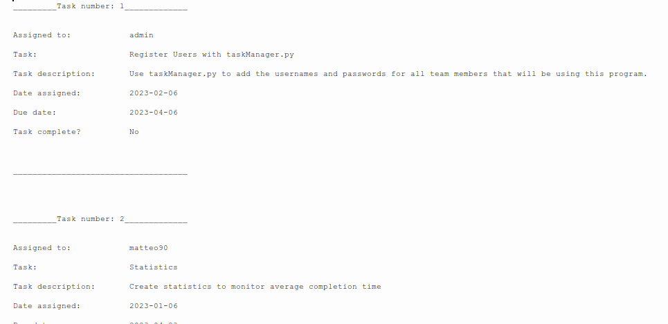
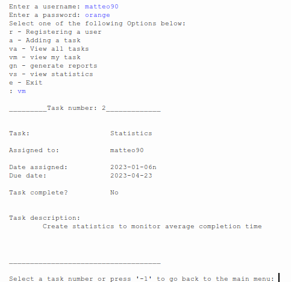

# Task Manager

### Quick overview

This program will make the life of a small business easier.
The program reads data from two txt files, 'user.txt' and 'tasks.txt'.
It allows to manage multiple tasks assigned to different users, edit a task's due date, register new users and assign 
a new task.
Additionally, it is possible for the admin to generate reports and statistics about tasks completion.
Once reports are generated, data are stored in two text files, 'tasks_overview.txt' and 'user_overview.txt'.
Data are displayed in a neatly formatted way, making it very easy to read.

### Installation

To run the program you just need to downlaod [PYthon3](https://www.python.org/downloads/). 
An IDE to run Python code should be included by default (IDLE). 
If not I recommend [Visual Studio Codium](https://vscodium.com/).
At the moment no GUI is provided.

### Usage

Below are some screenshot of how the program works:

- **View Statistics about tasks' completion**

- **View all tasks**
 

- **View tasks assigned to a particular user**

